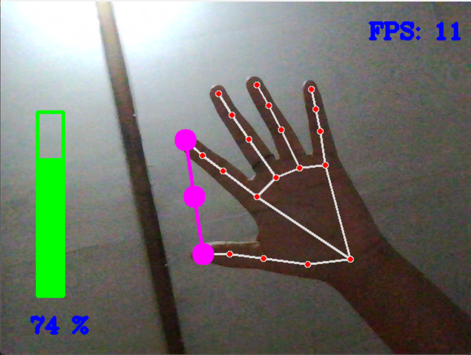
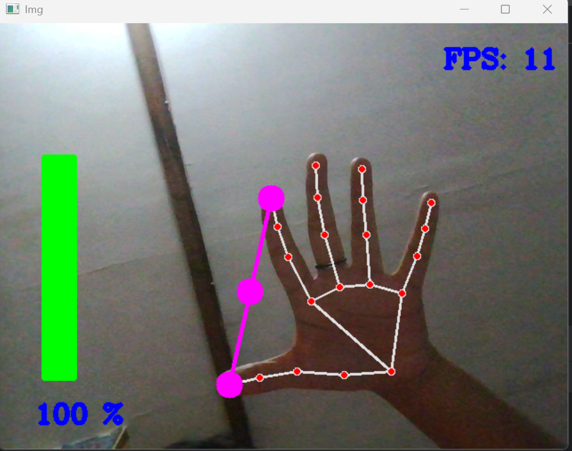
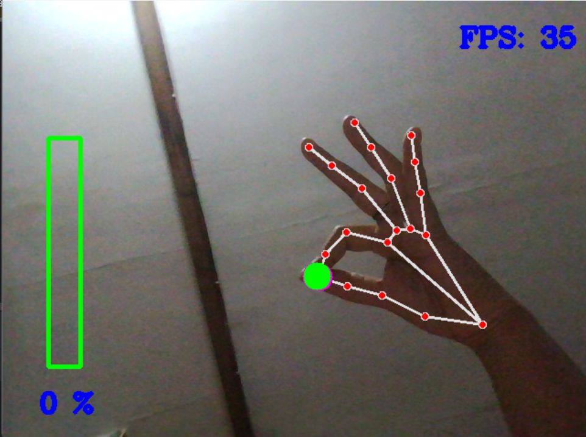

# 🎛️ Hand Tracking Audio Volume Controller
Ngatur volume laptop sekarang bisa pake tangan doang, gak perlu pencet tombol atau cari slider di Windows.
Cuma angkat jempol & telunjuk, buka lebar → volume naik, rapetin → volume turun.✌️

--------------------------------------------------

## Apa sih ini?
Proyek ini pake Package yang perlu diinstal :
- OpenCV-python → buat nangkep kamera real-time 🎥
- MediaPipe → deteksi tangan & landmark 🖐️
- PyCaw → langsung nyambung ke sistem audio Windows 🔊

Tujuannya? Biar ngatur volume jadi lebih gampang, hands-free, dan keliatan kayak hacker di film 🤭.

---------------------------------------------------
🔧 Cara Kerjanya
1. Kamera nyala → tangan kamu dideteksi.
2. Sistem ngecek jarak antara jempol & telunjuk.
3. Jarak kecil → volume kecil (mute kalau rapet banget).
4. Jarak jauh → volume gede.
5. Semua realtime, jadi kayak magic.

--------------------------------------------------------

  
  
  

